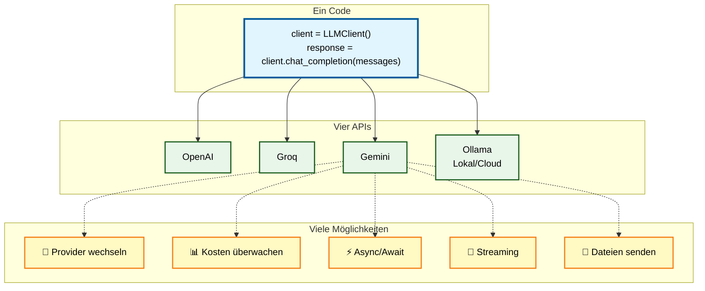

<p align="center">
  <a href="https://dgaida.github.io/llm_client/">
    
  </a>
</p>


[](https://opensource.org/licenses/MIT)
[](https://dgaida.github.io/llm_client/)
[](https://github.com/dgaida/llm_client/graphs/commit-activity)


Der **LLM Client** ist ein vielseitiges Python-Werkzeug, das eine **einheitliche Schnittstelle** für den Zugriff auf diverse KI-Anbieter wie [**OpenAI**](https://openai.com/de-DE/api/), [**Groq**](https://groq.com/), [**Google Gemini**](https://ai.google.dev/gemini-api) und [**Ollama**](https://ollama.com/) bietet. Die Software zeichnet sich durch eine **automatische API-Erkennung** aus, die bei fehlenden Schlüsseln flexibel auf eine lokale Ollama Instanz zurückgreift. Zu den technischen Highlights gehören präzise **Token-Zählung**, volle **Async-Unterstützung** sowie die Fähigkeit, während der Laufzeit dynamisch zwischen verschiedenen Providern zu wechseln. Dank einer sauberen Architektur auf Basis von Entwurfsmustern ermöglicht die Bibliothek zudem erweitertes **Tool-Calling** und den Upload verschiedenster Dateiformate. Die Bibliothek ermöglicht eine **einfache Handhabung** im Vergleich zu komplexeren Frameworks und bietet eine nahtlose Integration in Umgebungen wie Google Colab.



---


[](https://github.com/dgaida/llm_client/tags)

[](https://codecov.io/gh/dgaida/llm_client)
[](https://github.com/dgaida/llm_client/actions/workflows/tests.yml)
[](https://github.com/dgaida/llm_client/actions/workflows/lint.yml)
[](https://github.com/dgaida/llm_client/actions/workflows/codeql.yml)
[](https://github.com/psf/black)
[](https://github.com/astral-sh/ruff)

## 📑 Inhaltsverzeichnis

- [Features](#-features)  
- [Installation](#%EF%B8%8F-installation)  
- [Schnellstart](#-schnellstart)  
- [Verwendung](#-verwendung)  
- [Unterstützte APIs](#-unterstützte-apis--default-modelle)  
- [Dokumentation](#-dokumentation)  
- [Tests](#-tests-ausführen)  
- [Contributing](#-contributing)  
- [Lizenz](#-lizenz)  

## 🚀 Features

### Kern-Features  
* 🔍 **Automatische API-Erkennung** - Nutzt verfügbare API-Keys oder fällt auf Ollama zurück  
* ⚙️ **Einheitliches Interface** - Eine Methode für alle LLM-Backends  
* 🔄 **Dynamischer Provider-Wechsel** - Wechsel zwischen APIs zur Laufzeit ohne neues Objekt  
* 🧩 **Flexible Konfiguration** - Modell, Temperatur, Tokens frei wählbar  
* 🔐 **Google Colab Support** - Automatisches Laden von Secrets aus userdata  
* 📦 **Zero-Config** - Funktioniert out-of-the-box mit Ollama  
* 📊 **Token-Zählung mit tiktoken** - Präzise Token-Zählung für Kostenmanagement  
* ⚡ **Vollständige Async-Unterstützung** - Async/await für alle Provider  
* 📁 **Konfigurationsdateien** - YAML/JSON-Konfiguration für Multi-Provider-Setups  

### Architektur  
* 🏗️ **Strategy Pattern** - Saubere Architektur mit Provider-Klassen  
* 🏭 **Factory Pattern** - Zentrale Provider-Erstellung und -Verwaltung  

---

## ⚙️ Installation

### Schnellinstallation

```bash
pip install git+https://github.com/dgaida/llm_client.git
```

### Entwicklungsinstallation

```bash
git clone https://github.com/dgaida/llm_client.git
cd llm_client
pip install -e ".[dev]"
```

### Mit llama-index Support

```bash
pip install -e ".[llama-index]"
```

### Mit allen Features

```bash
pip install -e ".[all]"
```

---

## 🚦 Schnellstart

```python
from llm_client import LLMClient

# Automatische API-Erkennung
client = LLMClient()

messages = [
    {"role": "system", "content": "Du bist ein hilfreicher Assistent."},
    {"role": "user", "content": "Erkläre Machine Learning in einem Satz."}
]

response = client.chat_completion(messages)
print(response)
```

### Jupyter Notebook

Für einen umfassenden Überblick teste das Jupyter Notebook [llm_client_example.ipynb](notebooks/llm_client_example.ipynb) auf Google Colab.

---

## 🔧 Konfiguration

### API-Keys einrichten

Erstelle `secrets.env`:

```bash
# OpenAI
OPENAI_API_KEY=sk-xxxxxxxx

# Oder Groq
GROQ_API_KEY=gsk-xxxxxxxx

# Oder Google Gemini
GEMINI_API_KEY=AIzaSy-xxxxxxxx
```

**Ohne API-Keys**: Verwendet automatisch lokales [Ollama](https://ollama.com/) (Installation erforderlich).

### Google Colab

In Colab werden Keys automatisch aus `userdata` geladen:

```python
# Secrets → OPENAI_API_KEY, GROQ_API_KEY oder GEMINI_API_KEY hinzufügen
from llm_client import LLMClient
client = LLMClient()  # Lädt automatisch aus userdata
```

---

## 📚 Verwendung

### 📊 Token-Zählung

Zähle Tokens präzise für Kostenmanagement und Context-Limits. [→ Details](docs/de/usage/token-counting.md)

```python
token_count = client.count_tokens(messages)
print(f"Nachrichten enthalten {token_count} Tokens")
```

---

### ⚡ Async-Unterstützung

Nutze async/await für nicht-blockierende Operationen. [→ Details](docs/de/features.md#async-unterstützung)

```python
async_client = LLMClient(use_async=True)
response = await async_client.achat_completion(messages)
```

---

### 📁 Konfigurationsdateien

Verwalte mehrere Provider-Konfigurationen einfach via YAML/JSON. [→ Details](docs/de/features.md#konfigurationsdateien)

```python
client = LLMClient.from_config("llm_config.yaml")
```

---

### 🌊 Response-Streaming

Streame Antworten in Echtzeit für bessere UX. [→ Details](docs/de/features.md#response-streaming)

```python
for chunk in client.chat_completion_stream(messages):
    print(chunk, end="", flush=True)
```

---

### 🔄 Provider-Wechsel

Wechsle zwischen APIs zur Laufzeit. [→ Details](docs/de/features.md#dynamischer-provider-wechsel)

```python
client.switch_provider("gemini", llm="gemini-2.5-flash")
```

---

### 🧰 Tool-Calling

Nutze Function/Tool Calling für alle Provider. [→ Details](docs/de/features.md#tool-calling-function-calling)

```python
result = client.chat_completion_with_tools(messages, tools)
```

---

### 📎 Datei-Upload

Sende Bilder, PDFs und andere Dateien mit Chat-Anfragen. [→ Details](docs/de/features.md#datei-upload)

```python
response = client.chat_completion_with_files(
    messages,
    files=["image.jpg", "document.pdf"]
)
```

---

### ☁️ Ollama Cloud

Nutze leistungsstarke Cloud-Modelle ohne lokale GPU. [→ Details](docs/de/usage/providers/ollama_cloud.md)

```python
client = LLMClient(llm="gpt-oss:120b-cloud")
```

---

## 🧩 Unterstützte APIs & Default-Modelle

| API    | Default-Modell                     | Bemerkung                           |
| ------ |------------------------------------|-------------------------------------|
| OpenAI | `gpt-4o-mini`                      | Schnell, zuverlässig                |
| Groq   | `qwen/qwen3-32b` | Sehr effizient auf GroqCloud        |
| Gemini | `gemini-2.0-flash-exp`             | Googles neuestes Modell (Dez 2024)  |
| Ollama | `llama3.2:1b`                      | Läuft lokal, kein API-Key nötig     |

### Ollama Installation

```bash
# macOS/Linux
curl -fsSL https://ollama.ai/install.sh | sh

# Windows
# Download von https://ollama.ai/download

# Modell herunterladen
ollama pull llama3.2:1b
```

---

## 📖 Dokumentation

### Getting Started  
- [Installation & Setup](docs/de/installation.md)  
- [Schnellstart-Guide](docs/de/getting-started.md)  
- [API-Referenz](docs/de/api/llm_client.md)  

### Features  
- [Token-Zählung](docs/de/usage/token-counting.md)  
- [Async-Unterstützung](docs/de/features.md#async-unterstützung)  
- [Konfigurationsdateien](docs/de/features.md#konfigurationsdateien)  
- [Response-Streaming](docs/de/features.md#response-streaming)  
- [Provider-Wechsel](docs/de/features.md#dynamischer-provider-wechsel)  
- [Tool-Calling](docs/de/features.md#tool-calling-function-calling)  
- [Datei-Upload](docs/de/features.md#datei-upload)  

### Provider-Guides  
- [OpenAI](docs/de/usage/providers/openai.md)  
- [Groq](docs/de/usage/providers/groq.md)  
- [Google Gemini](docs/de/usage/providers/gemini.md)  
- [Ollama (lokal)](docs/de/usage/providers/ollama.md)  
- [Ollama Cloud](docs/de/usage/providers/ollama_cloud.md)  

### Weitere Ressourcen  
- [CLI-Nutzung](docs/de/usage/cli.md)  
- [Troubleshooting](docs/de/troubleshooting.md)  
- [CHANGELOG](CHANGELOG.md)  
- [Contributing Guidelines](CONTRIBUTING.md)  

---

## 🏗️ Projekt-Architektur

Das Projekt verwendet ein **Strategy Pattern** mit klarer Trennung von Verantwortlichkeiten:

```
llm_client/
├── base_provider.py      # Abstract Base Class für alle Provider
├── providers.py          # Konkrete Provider-Implementierungen
│   ├── OpenAIProvider
│   ├── GroqProvider
│   ├── GeminiProvider
│   └── OllamaProvider
├── async_providers.py    # Async Provider-Implementierungen
│   ├── AsyncOpenAIProvider
│   ├── AsyncGroqProvider
│   └── AsyncGeminiProvider
├── provider_factory.py   # Factory für Provider-Erstellung
├── llm_client.py        # Hauptklasse (verwendet Strategy Pattern)
├── adapter.py           # llama-index Integration
├── token_counter.py     # Token-Zähl-Utilities
├── config.py            # Konfigurationsdatei-Unterstützung
└── exceptions.py        # Custom Exception-Klassen
```

### Design Principles

1. **Strategy Pattern**: Verschiedene LLM-APIs als austauschbare Strategien  
2. **Factory Pattern**: Zentrale Provider-Erstellung und -Konfiguration  
3. **Single Responsibility**: Jede Klasse hat eine klar definierte Aufgabe  
4. **Dependency Injection**: Provider werden in LLMClient injiziert  
5. **Extensibility**: Neue APIs können leicht hinzugefügt werden  

---

## 🧪 Tests ausführen

```bash
# Alle Tests
pytest

# Mit Coverage
pytest --cov=llm_client --cov-report=html

# Einzelne Test-Datei
pytest tests/test_llm_client.py -v
```

Siehe [docs/de/development/testing.md](docs/de/development/testing.md) für Details.

---

## 👥 Contributing

Beiträge sind willkommen! Siehe [CONTRIBUTING.md](CONTRIBUTING.md) für Details.

---

## 📄 Lizenz

MIT License - siehe [LICENSE](LICENSE)

© 2026 Daniel Gaida, Technische Hochschule Köln

---

## 🔗 Weiterführende Links

* [Ollama Dokumentation](https://github.com/ollama/ollama)  
* [OpenAI API Reference](https://platform.openai.com/docs/api-reference)  
* [Groq Cloud](https://groq.com/)  
* [Google Gemini API](https://ai.google.dev/gemini-api/docs)  
* [Gemini OpenAI Compatibility](https://ai.google.dev/gemini-api/docs/openai)  
* [llama-index Docs](https://docs.llamaindex.ai/)  
* [Andrew Ng's AISuite](https://github.com/andrewyng/aisuite)  

---

## ⭐ Support

Wenn Ihnen dieses Projekt gefällt, geben Sie ihm einen Stern auf GitHub!

Fragen? Öffnen Sie ein [Issue](https://github.com/dgaida/llm_client/issues).
