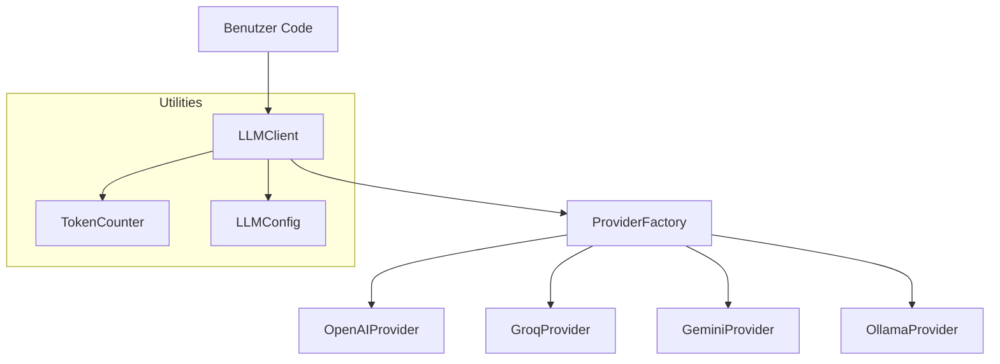

# Architektur

Der LLM Client ist modular aufgebaut und nutzt bewährte Entwurfsmuster.

## Systemübersicht

## Datenfluss

1. Der Benutzer sendet Nachrichten an den `LLMClient`.
2. Der `LLMClient` nutzt die `ProviderFactory`, um den richtigen Provider zu instanziieren.
3. Der Provider bereitet die Anfrage für die spezifische API vor.
4. Die Antwort wird normalisiert und an den Benutzer zurückgegeben.
