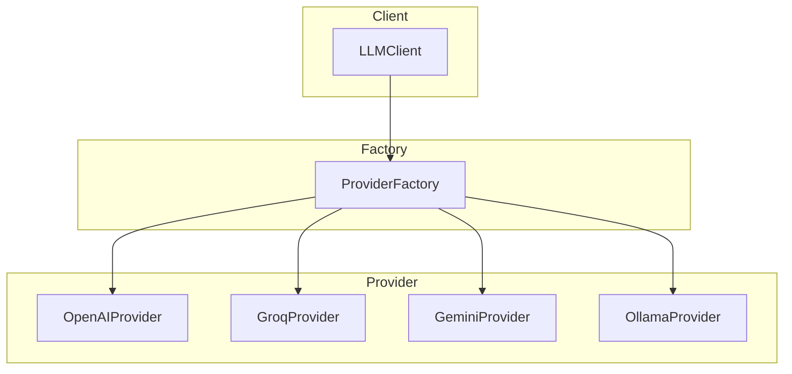
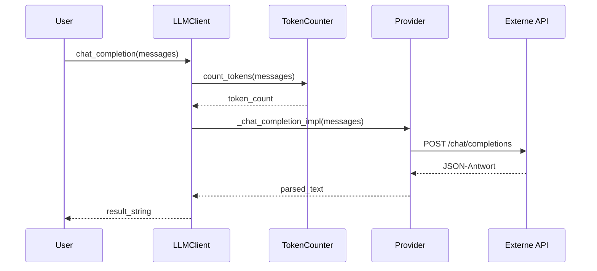
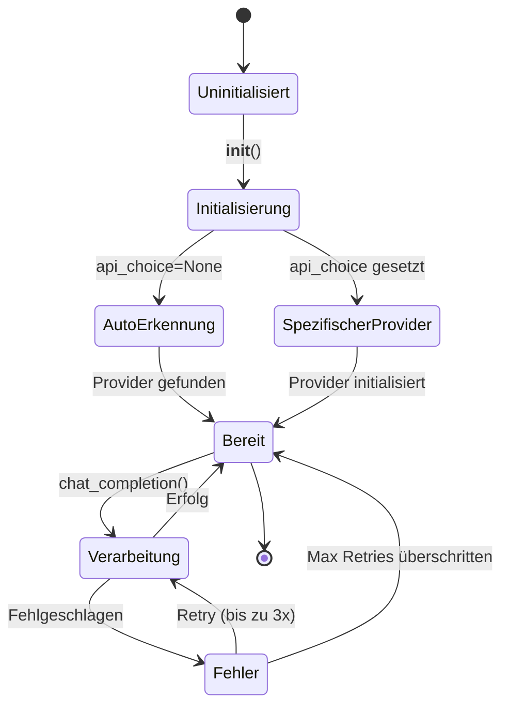

# Architektur

In diesem Abschnitt werden die interne Architektur und der Datenfluss des LLM Client beschrieben.

## Systemübersicht

Der LLM Client verwendet ein **Strategy Pattern**, um verschiedene LLM-Provider über ein einheitliches Interface zu unterstützen. Ein **Factory Pattern** wird verwendet, um den entsprechenden Provider basierend auf der Konfiguration oder Umgebung zu instanziieren.

## Datenfluss

Wenn ein Benutzer eine Nachricht sendet, durchläuft diese die folgenden Komponenten:

## Provider-Lebenszyklus

