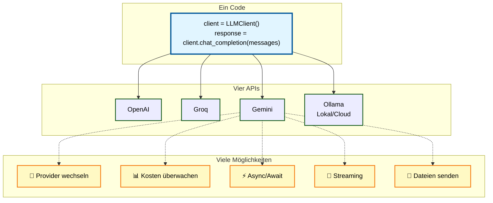

<p align="center">
  
</p>


Der **LLM Client** ist ein vielseitiges Python-Werkzeug, das eine **einheitliche Schnittstelle** für den Zugriff auf diverse KI-Anbieter wie [**OpenAI**](https://openai.com/de-DE/api/), [**Groq**](https://groq.com/), [**Google Gemini**](https://ai.google.dev/gemini-api) und [**Ollama**](https://ollama.com/) bietet. Die Software zeichnet sich durch eine **automatische API-Erkennung** aus, die bei fehlenden Schlüsseln flexibel auf eine lokale Ollama Instanz zurückgreift. Zu den technischen Highlights gehören präzise **Token-Zählung**, volle **Async-Unterstützung** sowie die Fähigkeit, während der Laufzeit dynamisch zwischen verschiedenen Providern zu wechseln. Dank einer sauberen Architektur auf Basis von Entwurfsmustern ermöglicht die Bibliothek zudem erweitertes **Tool-Calling** und den Upload verschiedenster Dateiformate. Die Bibliothek ermöglicht eine **einfache Handhabung** im Vergleich zu komplexeren Frameworks und bietet eine nahtlose Integration in Umgebungen wie Google Colab.



---

## 🚀 Features

### Kern-Features  
* 🔍 **Automatische API-Erkennung** - Nutzt verfügbare API-Keys oder fällt auf Ollama zurück  
* ⚙️ **Einheitliches Interface** - Eine Methode für alle LLM-Backends  
* 🔄 **Dynamischer Provider-Wechsel** - Wechsel zwischen APIs zur Laufzeit ohne neues Objekt  
* 🧩 **Flexible Konfiguration** - Modell, Temperatur, Tokens frei wählbar  
* 🔐 **Google Colab Support** - Automatisches Laden von Secrets aus userdata  
* 📦 **Zero-Config** - Funktioniert out-of-the-box mit Ollama  
* 📊 **Token-Zählung mit tiktoken** - Präzise Token-Zählung für Kostenmanagement  
* ⚡ **Vollständige Async-Unterstützung** - Async/await für alle Provider  
* 📁 **Konfigurationsdateien** - YAML/JSON-Konfiguration für Multi-Provider-Setups  

### Architektur  
* 🏗️ **Strategy Pattern** - Saubere Architektur mit Provider-Klassen  
* 🏭 **Factory Pattern** - Zentrale Provider-Erstellung und -Verwaltung  

## 🚦 Schnellstart

```python
from llm_client import LLMClient

# Automatische API-Erkennung
client = LLMClient()

messages = [
    {"role": "system", "content": "Du bist ein hilfreicher Assistent."},
    {"role": "user", "content": "Erkläre Machine Learning in einem Satz."}
]

response = client.chat_completion(messages)
print(response)
```

---

## 📖 Dokumentation

### Erste Schritte  
- [Installation](installation.md)  
- [Schnellstart-Guide](getting-started.md)  
- [API-Referenz](api/index.md)  

### Features  
- [Token-Zählung](usage/token-counting.md)  
- [Konfigurationsdateien](features.md)  

### Weitere Ressourcen  
- [CLI-Nutzung](usage/cli.md)  
- [Fehlerbehebung](troubleshooting.md)  
- [Changelog](changelog.md)  
- [Mitwirken](development/contributing.md)  
