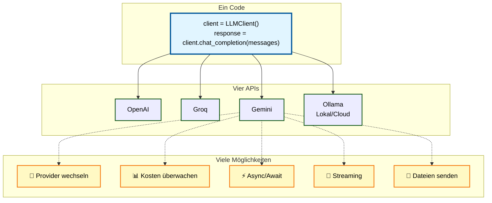

# 🧠 LLM Client




Ein universeller Python-Client zur Nutzung verschiedener Large Language Models (LLMs) über **OpenAI**, [**Groq**](https://groq.com/), [**Google Gemini**](https://ai.google.dev/gemini-api) oder [**Ollama**](https://ollama.com/) – mit automatischer API-Erkennung, dynamischem Provider-Wechsel, Token-Zählung, Async-Unterstützung und Konfigurationsdatei-Verwaltung.

---

## 🚀 Features

### Kern-Features
* 🔍 **Automatische API-Erkennung** - Nutzt verfügbare API-Keys oder fällt auf Ollama zurück
* ⚙️ **Einheitliches Interface** - Eine Methode für alle LLM-Backends
* 🔄 **Dynamischer Provider-Wechsel** - Wechsel zwischen APIs zur Laufzeit ohne neues Objekt
* 🧩 **Flexible Konfiguration** - Modell, Temperatur, Tokens frei wählbar
* 🔐 **Google Colab Support** - Automatisches Laden von Secrets aus userdata
* 📦 **Zero-Config** - Funktioniert out-of-the-box mit Ollama

### Architektur
* 🏗️ **Strategy Pattern** - Saubere Architektur mit Provider-Klassen
* 🏭 **Factory Pattern** - Zentrale Provider-Erstellung und -Verwaltung
* 🧪 **Vollständige Tests** - Pytest-basiert mit >92% Code-Coverage
* 🌟 **Google Gemini Support** - Nutzung via OpenAI-Kompatibilitätsmodus

## 🚦 Schnellstart

```python
from llm_client import LLMClient

# Automatische API-Erkennung
client = LLMClient()

messages = [
    {"role": "system", "content": "Du bist ein hilfreicher Assistent."},
    {"role": "user", "content": "Erkläre Machine Learning in einem Satz."}
]

response = client.chat_completion(messages)
print(response)
```

---

## 📖 Dokumentation

### Erste Schritte
- [Installation](installation.md)
- [Schnellstart-Guide](getting-started.md)
- [API-Referenz](api/index.md)

### Features
- [Token-Zählung](usage/token-counting.md)
- [Konfigurationsdateien](features.md)

### Weitere Ressourcen
- [CLI-Nutzung](usage/cli.md)
- [Fehlerbehebung](troubleshooting.md)
- [Changelog](changelog.md)
- [Mitwirken](development/contributing.md)
