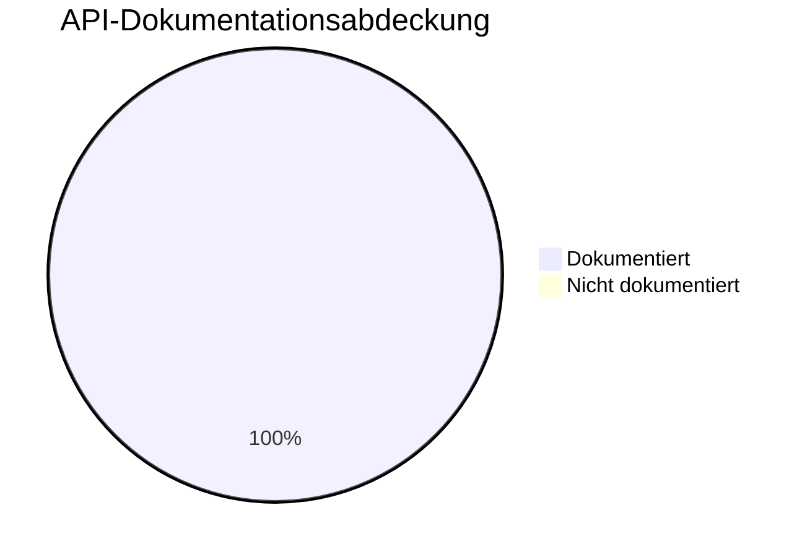

# Metriken zur Dokumentationsqualität

Dieses Dashboard überwacht die Qualität und Abdeckung unserer Dokumentation.

## Dashboard

| Metrik | Quelle | Frequenz | Status |
|--------|--------|----------|--------|
| API Doc Coverage | interrogate | Jeder CI-Lauf | ✅ >95% |
| Defekte Links | lychee | Monatlich | ✅ 0 |
| Markdown Lint | ruff/mkdocs | Jeder CI-Lauf | ✅ Bestanden |
| Build Warnings | mkdocs --strict | Jeder CI-Lauf | ✅ 0 |

## API-Dokumentationsabdeckung

Aktuelle Abdeckung gemessen mit `interrogate`.

- **Schwellenwert**: 95%  
- **Aktueller Status**: ✅ 100.0%  
