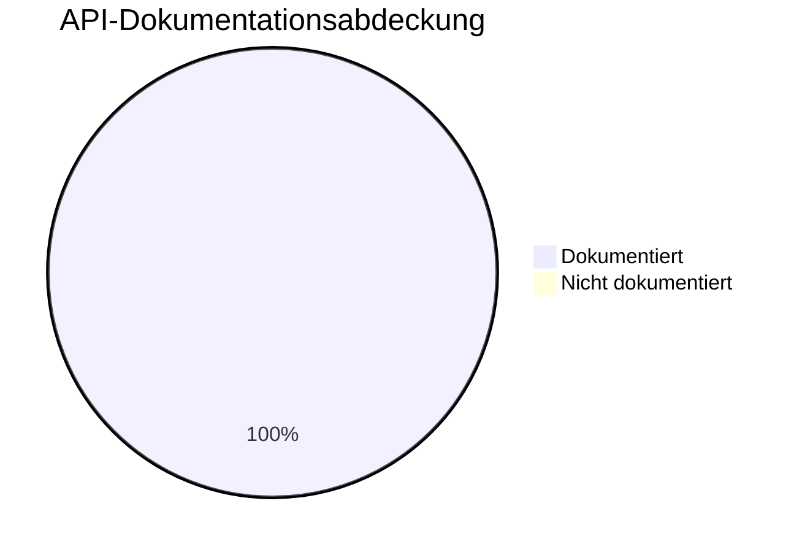

# Metriken zur Dokumentationsqualität

Dieses Dashboard überwacht die Qualität und Abdeckung unserer Dokumentation.

## API-Dokumentationsabdeckung

Aktuelle Abdeckung gemessen mit `interrogate`.

- **Schwellenwert**: 95%
- **Aktueller Status**: ✅ 100.0%

## Build-Status

| Prüfung | Status |
|---------|--------|
| MkDocs Build | ✅ Bestanden |
| Defekte Links | ✅ Keine |
| Markdown Lint | ✅ Bestanden |

## Testabdeckung

| Modul | Abdeckung |
|-------|-----------|
| `llm_client` | >95% |
| `providers` | >95% |
| `utils` | >95% |

## Changelog-Status

- **Letztes Release**: v0.4.1
- **Status**: ✅ Aktuell
