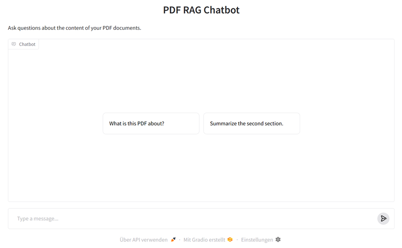
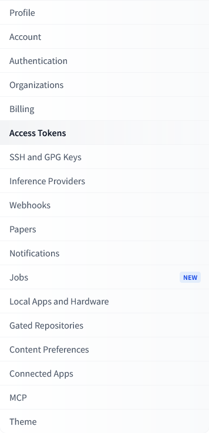
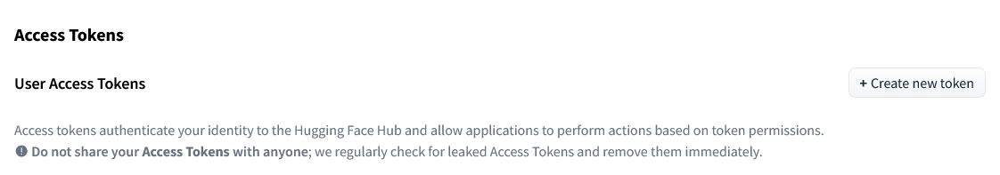
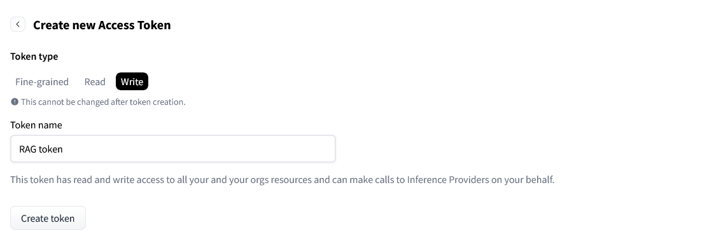
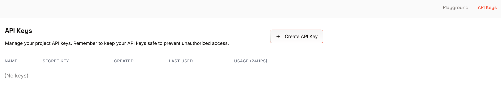
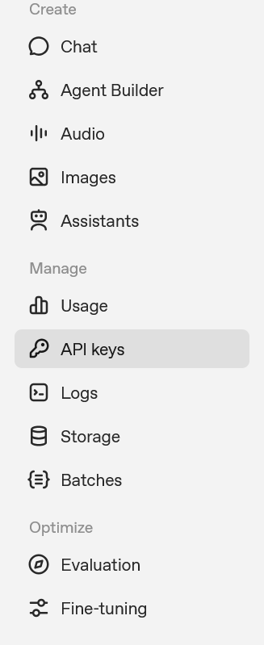
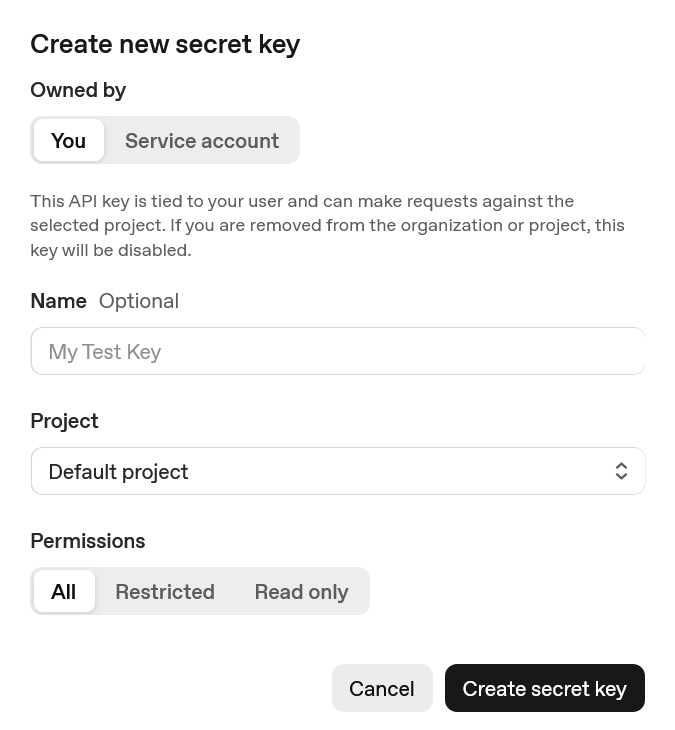
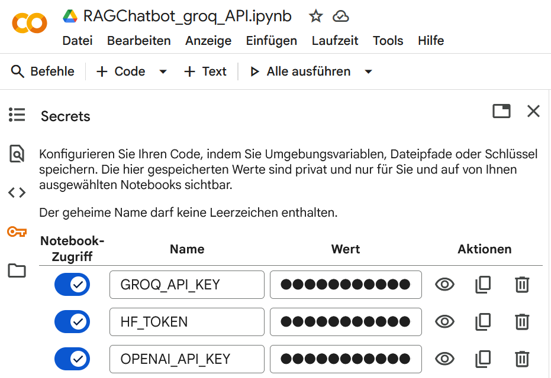

# RAG Chatbot mit Groq API und Text-to-Speech (TTS)

[](https://colab.research.google.com/github/dgaida/llm_client/blob/master/notebooks/RAGChatbot_groq_API_t2s.ipynb)

- [Überblick über Retrieval-Augmented Generation (RAG)](#ueberblick-ueber-retrieval-augmented-generation-rag)
- [🚀 Inhalt des Notebooks](#inhalt-des-notebooks)
- [🔑 Erforderliche API Keys](#erforderliche-api-keys)
- [🦮 Hugging Face Access Token erstellen](#hugging-face-access-token-erstellen)
- [⚡️ Groq API Key erstellen](#groq-api-key-erstellen)
- [🔮 OpenAI API Key erstellen](#openai-api-key-erstellen)
- [Google Gemini API Key erstellen](#google-gemini-api-key-erstellen)
- [☁️ API Keys als Secrets in Google Colab hinterlegen](#api-keys-als-secrets-in-google-colab-hinterlegen)
- [⚙️ Nutzung von LLMClient im Notebook](#nutzung-von-llmclient-im-notebook)
- [Ressourcen zu RAG](#ressourcen-zu-rag)
- [🧩 Lizenz](#-lizenz)

Das Notebook [`RAGChatbot_groq_API_t2s.ipynb`](https://github.com/dgaida/llm_client/blob/master/notebooks/RAGChatbot_groq_API_t2s.ipynb) zeigt, wie man mit der Klasse [`LLMClient`](https://github.com/dgaida/llm_client/blob/master/llm_client/llm_client.py) einen **Retrieval-Augmented-Generation (RAG)**-Chatbot erstellt, der zusätzlich über eine **Text-to-Speech (TTS)**-Funktion verfügt. Zur Sprachsynthese wird das Modell [**Kokoro**](https://huggingface.co/hexgrad/Kokoro-82M) verwendet.

{ width="750" style="display: block; margin: 0 auto" }

---

## Überblick über Retrieval-Augmented Generation (RAG) {: #ueberblick-ueber-retrieval-augmented-generation-rag }

Retrieval-Augmented Generation (RAG) kombiniert **Wissen aus eigenen Dokumenten** mit der **Sprachkompetenz großer KI-Modelle** wie ChatGPT.
Statt dass das Modell nur auf sein internes (und begrenztes) Trainingswissen zugreift, sucht RAG zuerst gezielt in einer **Wissensdatenbank** oder **Dokumentsammlung** nach relevanten Textstellen („Retrieval“) und übergibt diese dann zusammen mit der Nutzerfrage an das **Large Language Model** („Generation“).

Zusätzlich integriert dieses Tutorial **Text-to-Speech (TTS)**, um die generierten Antworten direkt in Sprache umzuwandeln. Dies ermöglicht eine natürlichere Interaktion mit dem Chatbot.

Das folgende Schaubild zeigt den grundlegenden Aufbau eines RAG-Systems:


*Abbildung: „High-level overview of the Retrieval Augmented Generation System“
von [Maanjunath S Naragund](https://maanjunathn07ds.medium.com/), entnommen aus [diesem Blogbeitrag auf Medium](https://blog.gopenai.com/step-by-step-guide-to-implementing-retrieval-augmented-generation-in-python-4801be2771c3).
Icons von Flaticon. Verwendung im Rahmen des Zitatrechts (§ 51 UrhG). Diese Abbildung steht **nicht unter der MIT-Lizenz** dieses Repositories.*

---

## 🚀 Inhalt des Notebooks {: #inhalt-des-notebooks }

Das Notebook demonstriert:

1. Installation der benötigten Packages in **Google Colab** (einschließlich `kokoro` für TTS)
2. Nutzung der `LLMClient`-Klasse zur Textgenerierung
3. Aufbau eines **RAG-Workflows** mit PDF-Dokumenten und ChromaDB
4. Integration von **Text-to-Speech (TTS)** mit dem Kokoro-Modell zur Sprachausgabe der Antworten

---

## 🔑 Erforderliche API Keys {: #erforderliche-api-keys }

| Dienst | Pflicht | Zweck |
|--------|----------|--------|
| **Hugging Face Access Token** | ✅ **erforderlich** | Herunterladen des Embedding-Modells und des Kokoro-TTS-Modells |
| **Groq API Key** | optional | Nutzung der [`Groq`](https://console.groq.com/home) LLM-API |
| **OpenAI API Key** | optional | Nutzung der OpenAI LLM-API |

---

## 🦮 Hugging Face Access Token erstellen {: #hugging-face-access-token-erstellen }

Der Hugging Face Access Token wird benötigt, um auf **Embedding-Modelle** und andere KI-Modelle aus der Hugging Face Model Hub zuzugreifen, die zur Berechnung der Satz-Embeddings verwendet werden. Diese werden von dem Model Hub heruntergeladen und lokal ausgeführt.

1. Erstelle kostenlosen Account bei [https://huggingface.co/](https://huggingface.co/) oder logge dich ein (falls nötig).

2. Gehe zu [https://huggingface.co/settings/tokens](https://huggingface.co/settings/tokens)

{ width="250" style="display: block; margin: 0 auto" }

3. Klicke auf die Schaltfläche **„Create new token“**

{ width="850" style="display: block; margin: 0 auto" }

4. Gib einen Namen ein (z. B. `colab-rag`) und wähle **Type: Write**

{ width="850" style="display: block; margin: 0 auto" }

5. Kopiere den angezeigten Token (beginnt meist mit `hf_...`).

---

## ⚡️ Groq API Key erstellen {: #groq-api-key-erstellen }

Der Groq API Key ermöglicht den Zugriff auf öffentlich verfügbare **LLMs**, die für besonders schnelle **Textgenerierung und Beantwortung von Fragen** im RAG-Workflow eingesetzt werden können. Diese LLMs werden in der GroqCloud ausgeführt.

1. Erstelle kostenlosen Account bei [https://groq.com/](https://groq.com/) oder logge dich ein (falls nötig).
2. Besuche [https://console.groq.com/keys](https://console.groq.com/keys)
3. Klicke auf **„Create API Key“**



4. Kopiere den Schlüssel (beginnt meist mit `groq_...`).

---

## 🔮 OpenAI API Key erstellen {: #openai-api-key-erstellen }

Der OpenAI API Key erlaubt die Nutzung von **OpenAI-Modellen** (z. B. GPT-4 oder GPT-4o), um **kontextbezogene Antworten** im Retrieval-Augmented-Generation-System zu erzeugen.

1. Melde dich bei [https://platform.openai.com/account/api-keys](https://platform.openai.com/account/api-keys) an

{ width="175" style="display: block; margin: 0 auto" }

2. Klicke auf „Create new secret key“

{ width="450" style="display: block; margin: 0 auto" }

3. Kopiere den Key (beginnt meist mit `sk-...`).

---

## Google Gemini API Key erstellen {: #google-gemini-api-key-erstellen }

1. Besuche [Google AI Studio](https://aistudio.google.com/apikey)
2. Klicke auf **"Get API Key"** oder **"Create API Key"**
3. Wähle ein Google Cloud Projekt oder erstelle ein neues
4. Kopiere den generierten API Key (beginnt mit `AIzaSy...`)

**Hinweis**: Die Gemini API wird über den OpenAI-Kompatibilitätsmodus angesprochen, benötigt deshalb nur das `openai` Python-Package.

---

## ☁️ API Keys als Secrets in Google Colab hinterlegen {: #api-keys-als-secrets-in-google-colab-hinterlegen }

1. Klicke im Menü links auf das Schlüssel-Symbol 🔑

{ width="600" style="display: block; margin: 0 auto" }

2. Lege folgende Secrets an:

   | Name | Wert |
   |-------|------|
   | `HF_TOKEN` | dein Hugging Face Access Token |
   | `GROQ_API_KEY` | (optional) dein Groq API Key |
   | `OPENAI_API_KEY` | (optional) dein OpenAI API Key |

---

## ⚙️ Nutzung von LLMClient im Notebook {: #nutzung-von-llmclient-im-notebook }

```python
from llm_client import LLMClient

# LLMClient erkennt automatisch, welche Keys gesetzt sind
client = LLMClient()

print("Verwendete API:", client.api_choice)
print("Modell:", client.llm)
```

---

## Ressourcen zu RAG

[`Coursera Kurs zu Retrieval Augmented Generation (RAG) von DeepLearning.AI`](https://www.coursera.org/learn/retrieval-augmented-generation-rag/)

---

## 🧩 Lizenz {: #-lizenz }

Dieses Notebook ist Teil des Repositories [**dgaida/llm_client**](https://github.com/dgaida/llm_client).
© 2025 – Daniel Gaida, Technische Hochschule.
Lizenziert unter der **MIT License**.
