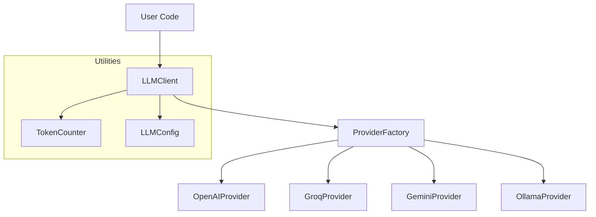

# Architecture

The LLM Client is built modularly and uses proven design patterns.

## System Overview

## Data Flow

1. The user sends messages to the `LLMClient`.  
2. The `LLMClient` uses the `ProviderFactory` to instantiate the correct provider.  
3. The provider prepares the request for the specific API.  
4. The response is normalized and returned to the user.  
