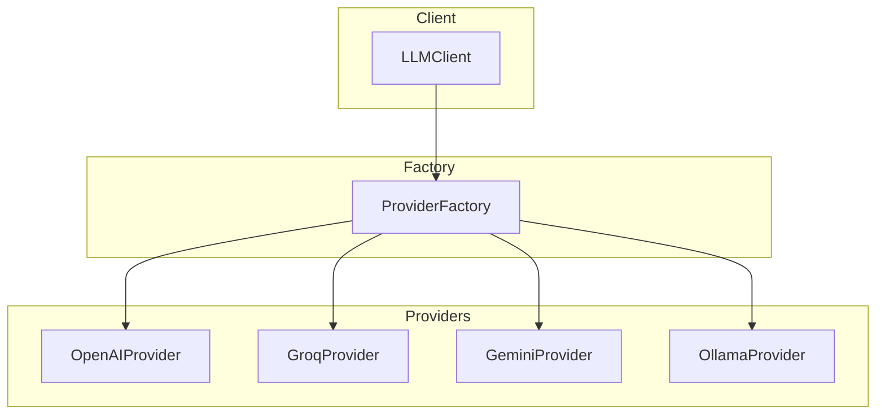
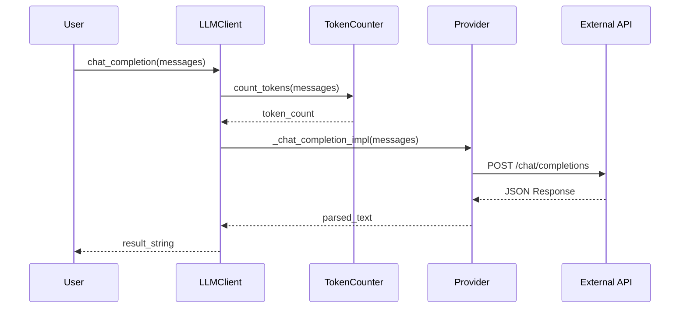
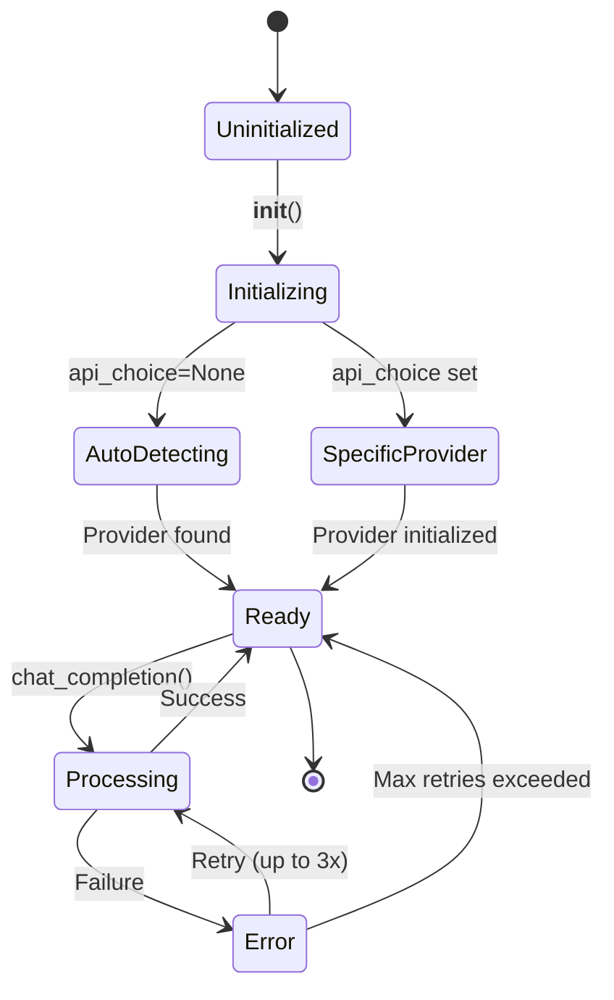

# Architecture

This section describes the internal architecture and data flow of the LLM Client.

## System Overview

The LLM Client uses a **Strategy Pattern** to support multiple LLM providers through a unified interface. A **Factory Pattern** is used to instantiate the appropriate provider based on configuration or environment.

## Data Flow

When a user sends a message, it flows through the following components:

## Provider Lifecycle

