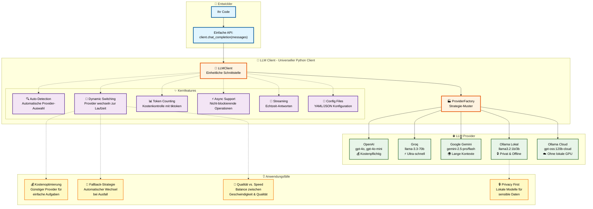

# Features Overview

LLM Client provides a comprehensive set of features for working with multiple LLM providers. This page gives you an overview of all available features.

---

## 🎯 Core Features



## Automatic API Detection {: #automatic-api-detection }

LLM Client automatically detects which LLM provider to use based on available API keys.

#### Generic API Key Support (Recommended)

In addition to provider-specific keys (`OPENAI_API_KEY`, etc.), the client supports a generic `API_KEY` variable. This is the recommended approach as the client analyzes the key prefix to determine the provider automatically:

| Prefix | Detected Provider |
|--------|-------------------|
| `sk-`   | OpenAI            |
| `gsk-`  | Groq              |
| `gsk_`  | Groq              |
| `AIza`  | Google Gemini     |

#### Example

```python
import os
from llm_client import LLMClient

# Set only a generic key
os.environ["API_KEY"] = "sk-..."

# Client automatically detects it's OpenAI
client = LLMClient()
print(client.api_choice) # "openai"
```


---

### Unified Interface

One consistent API for all providers - no need to learn different APIs:

```python
# Same code works with any provider
messages = [{"role": "user", "content": "Hello!"}]

# Works with OpenAI
openai_client = LLMClient(api_choice="openai")
response1 = openai_client.chat_completion(messages)

# Works with Groq
groq_client = LLMClient(api_choice="groq")
response2 = groq_client.chat_completion(messages)

# Works with Gemini
gemini_client = LLMClient(api_choice="gemini")
response3 = gemini_client.chat_completion(messages)
```

[:octicons-arrow-right-24: See examples](usage/basic-usage.md)

---

## ✨ Advanced Features (v0.3.0)

## Token Counting {: #token-counting }

Accurate token counting with tiktoken for cost management:

```python
# Count tokens before sending
token_count = client.count_tokens(messages)
print(f"This will use ~{token_count} tokens")

# Check budget
if token_count < 4000:
    response = client.chat_completion(messages)
```

[:octicons-arrow-right-24: Token Counting Guide](usage/token-counting.md)

---

## Async Support {: #async-support }

Full async/await support for non-blocking operations:

```python
# Create async client
async_client = LLMClient(use_async=True)

# Async completion
response = await async_client.achat_completion(messages)

# Async streaming
async for chunk in async_client.achat_completion_stream(messages):
    print(chunk, end="", flush=True)
```

[:octicons-arrow-right-24: Async Guide](#async-support)

---

## Configuration Files {: #configuration-files }

Manage multiple provider configurations with YAML/JSON:

```python
# Load from config file
client = LLMClient.from_config("llm_config.yaml")

# Use specific provider
client = LLMClient.from_config("llm_config.yaml", provider="groq")
```

Example `llm_config.yaml`:
```yaml
default_provider: openai

providers:
  openai:
    model: gpt-4o-mini
    temperature: 0.7

  groq:
    model: llama-3.3-70b-versatile
    temperature: 0.5
```

[:octicons-arrow-right-24: Configuration Guide](#configuration-files)

---

## Response Streaming {: #response-streaming }

Stream responses in real-time for better UX:

```python
messages = [{"role": "user", "content": "Tell me a story"}]

print("Response: ", end="")
for chunk in client.chat_completion_stream(messages):
    print(chunk, end="", flush=True)
print()
```

[:octicons-arrow-right-24: Streaming Guide](#response-streaming)

---

## Dynamic Provider Switching {: #dynamic-provider-switching }

Switch between providers at runtime:

```python
# Start with OpenAI
client = LLMClient(api_choice="openai")
response1 = client.chat_completion(messages)

# Switch to Groq
client.switch_provider("groq")
response2 = client.chat_completion(messages)

# Switch to Gemini with new parameters
client.switch_provider("gemini", temperature=0.8)
response3 = client.chat_completion(messages)
```

**Use Cases:**  
- Cost optimization  
- Fallback strategies  
- A/B testing  
- Quality vs. speed trade-offs  

[:octicons-arrow-right-24: Provider Switching Guide](#dynamic-provider-switching)

---

## Tool Calling {: #tool-calling-function-calling }

OpenAI-compatible function/tool calling for all providers:

```python
tools = [{
    "type": "function",
    "function": {
        "name": "get_weather",
        "description": "Get weather for a location",
        "parameters": {
            "type": "object",
            "properties": {
                "location": {"type": "string"}
            }
        }
    }
}]

result = client.chat_completion_with_tools(messages, tools)

if result['tool_calls']:
    for call in result['tool_calls']:
        print(f"Calling: {call['function']['name']}")
```

[:octicons-arrow-right-24: Tool Calling Guide](#tool-calling-function-calling)

---

## File Upload {: #file-upload }

Upload images, PDFs, videos, and audio with your messages:

```python
# Analyze an image
messages = [{"role": "user", "content": "What's in this image?"}]
response = client.chat_completion_with_files(
    messages,
    files=["photo.jpg"]
)

# Analyze a PDF
messages = [{"role": "user", "content": "Summarize this document"}]
response = client.chat_completion_with_files(
    messages,
    files=["report.pdf"]
)
```

**Supported Formats by Provider:**

| Provider | Images | PDFs | Videos | Audio |
|----------|--------|------|--------|-------|
| OpenAI   | ✅     | ✅   | ❌     | ❌    |
| Gemini   | ✅     | ✅   | ✅     | ✅    |
| Groq     | ✅     | ❌   | ❌     | ❌    |
| Ollama   | ✅     | ❌   | ❌     | ❌    |

[:octicons-arrow-right-24: File Upload Guide](#file-upload)

---

### ☁️ Ollama Cloud

Access powerful cloud models without local GPU:

```python
# Automatic cloud detection
client = LLMClient(llm="gpt-oss:120b-cloud")

# Or explicit cloud mode
client = LLMClient(
    api_choice="ollama",
    llm="gpt-oss:120b-cloud",
    use_ollama_cloud=True
)
```

**Benefits:**  
- No local GPU needed  
- Access to large models (120B+)  
- Fast inference  
- Easy switching between local and cloud  

[:octicons-arrow-right-24: Ollama Cloud Guide](usage/providers/ollama_cloud.md)

---

## 🛠️ Developer Features

### Provider and Model Listing

Query supported and currently available providers (whose library is installed in the current environment), as well as available models for each provider:

```python
from llm_client import LLMClient

# Get all supported providers
supported = LLMClient.get_supported_providers()
print(supported)
# Output: ['openai', 'groq', 'gemini', 'ollama', 'kiconnect']

# Get currently available/installed providers
available = LLMClient.get_available_providers()
print(available)
# Output: e.g., ['openai', 'groq', 'gemini', 'ollama', 'kiconnect']

# Get available models for the currently active provider
client = LLMClient(api_choice="openai")
models = client.list_models()
print(models)
# Output: e.g., ['gpt-4o', 'gpt-4o-mini', ...]
```

---

### Comprehensive Logging

Built-in logging for debugging and monitoring:

```python
from llm_client import setup_logging

# Enable debug logging
setup_logging(level="DEBUG")

# Your code here
client = LLMClient()
```

[:octicons-arrow-right-24: Logging Guide](development/logging.md)

---

### Custom Exceptions

Detailed exception hierarchy for better error handling:

```python
from llm_client.exceptions import (
    APIKeyNotFoundError,
    ChatCompletionError,
    InvalidProviderError
)

try:
    client = LLMClient(api_choice="openai")
    response = client.chat_completion(messages)
except APIKeyNotFoundError as e:
    print(f"Missing API key: {e.key_name}")
except ChatCompletionError as e:
    print(f"API error: {e}")
```

[:octicons-arrow-right-24: Exception Reference](api/exceptions.md)

---

### Retry Logic

Automatic retry with exponential backoff:

```python
# Automatically retries up to 3 times
# with delays: 4s, 8s, 10s
response = client.chat_completion(messages)
```

---

### Type Hints

Full type hints for better IDE support:

```python
from llm_client import LLMClient
from typing import List, Dict

def process_conversation(
    client: LLMClient,
    messages: List[Dict[str, str]]
) -> str:
    return client.chat_completion(messages)
```

---

## 📦 Integration Features

### Google Colab Support

Automatic secret loading in Google Colab:

```python
# Add keys to Colab Secrets (🔑 icon)
# Keys: OPENAI_API_KEY, GROQ_API_KEY, etc.

from llm_client import LLMClient

# Automatically loads from Colab secrets
client = LLMClient()
```

---

### llama-index Integration

Seamless integration with llama-index:

```python
from llm_client import LLMClientAdapter, LLMClient
from llama_index.core import VectorStoreIndex, SimpleDirectoryReader

# Create adapter
llm_adapter = LLMClientAdapter(client=LLMClient())

# Use in llama-index
documents = SimpleDirectoryReader("data").load_data()
index = VectorStoreIndex.from_documents(documents, llm=llm_adapter)
```

---

## 🎯 Comparison with Other Libraries

### vs. OpenAI SDK

| Feature | LLM Client | OpenAI SDK |
|---------|-----------|------------|
| Multi-provider | ✅ | ❌ |
| Auto-detection | ✅ | ❌ |
| Token counting | ✅ | ❌ |
| Provider switching | ✅ | ❌ |
| Unified interface | ✅ | ❌ |
| Streaming | ✅ | ✅ |

### vs. LangChain

| Feature | LLM Client | LangChain |
|---------|-----------|-----------|
| Simplicity | ✅ Simple | ⚠️ Complex |
| Multi-provider | ✅ | ✅ |
| Async support | ✅ | ✅ |
| File upload | ✅ | ⚠️ Limited |
| Learning curve | Low | High |

---

## 🚀 Coming Soon

Features planned for future releases:

- [ ] Embedding support  
- [ ] Batch processing  
- [ ] Caching layer  
- [ ] Prompt templates  
- [ ] More providers (Anthropic, Cohere)  
- [ ] Advanced RAG utilities  

---

## 📚 Learn More

- [Getting Started](getting-started.md) - Installation and setup  
- [API Reference](api/llm_client.md) - Complete API documentation  
- [Examples](usage/basic-usage.md) - Real-world examples  
- [Troubleshooting](troubleshooting.md) - Common issues  

---

## 💡 Need Help?

- 📖 [Documentation](getting-started.md)  
- 🐛 [Report Issues](https://github.com/dgaida/llm_client/issues)  
