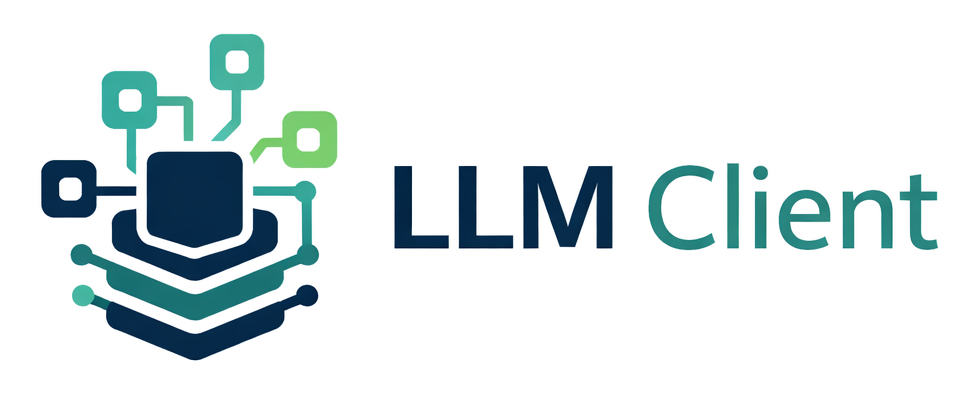
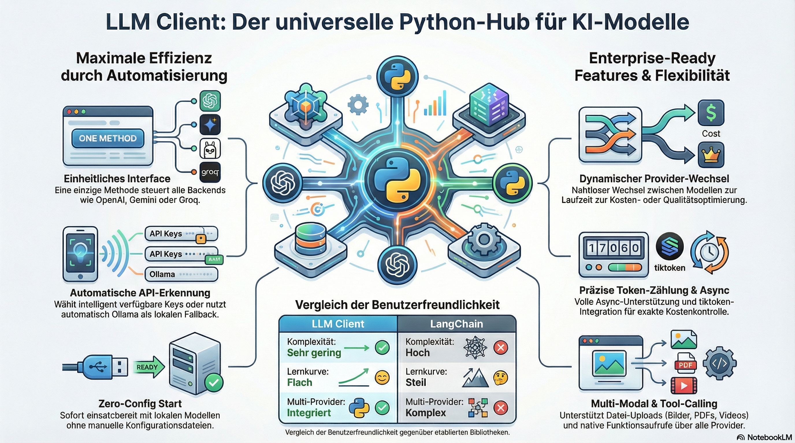
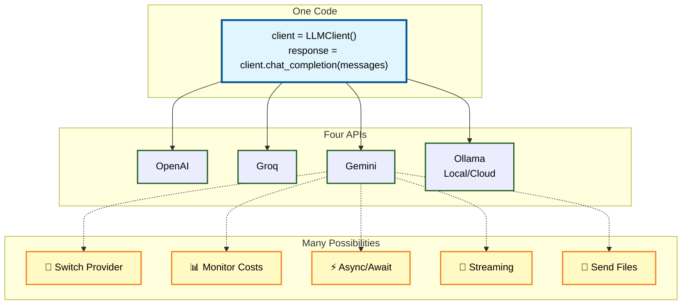

<p align="center">
  
</p>



The **LLM Client** is a versatile Python tool that provides a **unified interface** for accessing various AI providers such as [**OpenAI**](https://openai.com/de-DE/api/), [**Groq**](https://groq.com/), [**Google Gemini**] (https://ai.google.dev/gemini-api), and [**Ollama**](https://ollama.com/). The software features **automatic API detection**, which flexibly falls back to a local Ollama instance if keys are missing. Technical highlights include precise **token counting**, full **async support**, and the ability to switch dynamically between different providers during runtime. Thanks to a clean architecture based on design patterns, the library also enables advanced **tool calling** and the upload of a wide variety of file formats. The library is **easy to use** compared to more complex frameworks and offers seamless integration into environments such as Google Colab.



---

## 🚀 Features

### Core Features
* 🔍 **Automatic API Detection** - Uses available API keys or falls back to Ollama
* ⚙️ **Unified Interface** - One method for all LLM backends
* 🔄 **Dynamic Provider Switching** - Switch between APIs at runtime without creating a new object
* 🧩 **Flexible Configuration** - Model, temperature, tokens freely adjustable
* 🔐 **Google Colab Support** - Automatic loading of secrets from userdata
* 📦 **Zero-Config** - Works out-of-the-box with Ollama
* 📊 **Token counting with tiktoken** - Precise token counting for cost management
* ⚡ **Full async support** - Async/await for all providers
* 📁 **Configuration files** - YAML/JSON configuration for multi-provider setups

### Architecture
* 🏗️ **Strategy Pattern** - Clean architecture with provider classes
* 🏭 **Factory Pattern** - Central provider creation and management

## 🚦 Quick Start

```python
from llm_client import LLMClient

# Automatic API detection
client = LLMClient()

messages = [
    {"role": "system", "content": "You are a helpful assistant."},
    {"role": "user", "content": "Explain machine learning in one sentence."}
]

response = client.chat_completion(messages)
print(response)
```

---

## 📖 Documentation

### Getting Started
- [Installation](installation.md)
- [Quick Start Guide](getting-started.md)
- [API Reference](api/index.md)

### Features
- [Token Counting](usage/token-counting.md)
- [Configuration Files](features.md)

### Further Resources
- [CLI Usage](usage/cli.md)
- [Troubleshooting](troubleshooting.md)
- [Changelog](changelog.md)
- [Contributing](development/contributing.md)
