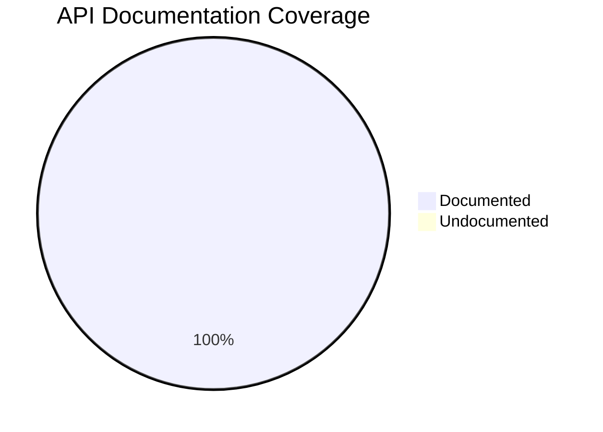

# Documentation Quality Metrics

This dashboard tracks the quality and coverage of our documentation.

## API Documentation Coverage

Current coverage measured by `interrogate`.

- **Threshold**: 95%  
- **Current Status**: ✅ 100.0%  

## Build Status

| Check | Status |
|-------|--------|
| MkDocs Build | ✅ Passing |
| Broken Links | ✅ None |
| Markdown Lint | ✅ Passing |

## Test Coverage

| Module | Coverage |
|--------|----------|
| `llm_client` | >95% |
| `providers` | >95% |
| `utils` | >95% |

## Changelog Freshness

- **Last Release**: v0.4.1  
- **Status**: ✅ Up to date  
