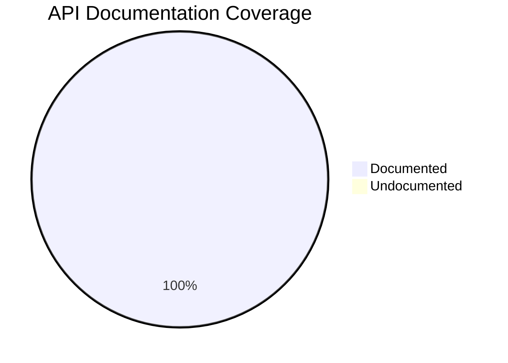

# Documentation Quality Metrics

This dashboard monitors the quality and coverage of our documentation.

## Dashboard

| Metric | Source | Frequency | Status |
|--------|--------|-----------|--------|
| API Doc Coverage | interrogate | Every CI run | ✅ >95% |
| Broken Links | lychee | Monthly | ✅ 0 |
| Markdown Lint | ruff/mkdocs | Every CI run | ✅ Passed |
| Build Warnings | mkdocs --strict | Every CI run | ✅ 0 |

## API Documentation Coverage

Current coverage measured with `interrogate`.

- **Threshold**: 95%  
- **Current Status**: ✅ 100.0%  
