```mermaid
graph TD
    START([🧠 LLM Client])

    subgraph CORE["🎯 Kern-Konzept"]
        CONCEPT["Ein Interface<br/>Alle Provider<br/>Null Komplexität"]
    end

    subgraph PROVIDERS["🌐 Unterstützte Provider"]
        P1[OpenAI<br/>✅ API Key erforderlich<br/>🚀 Beste Qualität]
        P2[Groq<br/>✅ API Key erforderlich<br/>⚡ Ultra-schnell]
        P3[Gemini<br/>✅ API Key erforderlich<br/>📚 Lange Kontexte 1M-2M]
        P4[Ollama<br/>❌ Kein API Key<br/>🔒 100% Privat & Lokal]
    end

    subgraph FEATURES["✨ Features v0.3.0"]
        F1[📊 Token Counting<br/>Kosten im Blick]
        F2[⚡ Async/Await<br/>Nicht-blockierend]
        F3[📁 Config Files<br/>YAML/JSON]
        F4[🌊 Streaming<br/>Echtzeit]
        F5[🔄 Dynamic Switching<br/>Zur Laufzeit]
        F6[📎 File Upload<br/>Bilder, PDFs, Videos]
    end

    subgraph BENEFITS["💡 Vorteile"]
        B1[💰 Kosten sparen<br/>Günstigster Provider<br/>für jede Aufgabe]
        B2[🛡️ Ausfallsicher<br/>Automatischer Fallback<br/>bei API-Ausfall]
        B3[🔒 Datenschutz<br/>Lokale Modelle für<br/>sensible Daten]
        B4[⚖️ Flexibel<br/>Speed vs. Quality<br/>je nach Bedarf]
    end

    START --> CORE
    CORE --> PROVIDERS
    PROVIDERS --> FEATURES
    FEATURES --> BENEFITS

    classDef startClass fill:#e1f5ff,stroke:#01579b,stroke-width:4px,color:#000
    classDef conceptClass fill:#fff3e0,stroke:#e65100,stroke-width:3px,color:#000
    classDef providerClass fill:#e8f5e9,stroke:#1b5e20,stroke-width:2px,color:#000
    classDef featureClass fill:#f3e5f5,stroke:#4a148c,stroke-width:2px,color:#000
    classDef benefitClass fill:#fff9c4,stroke:#f57f17,stroke-width:2px,color:#000

    class START startClass
    class CONCEPT conceptClass
    class P1,P2,P3,P4 providerClass
    class F1,F2,F3,F4,F5,F6 featureClass
    class B1,B2,B3,B4 benefitClass
```

# Getting Started with LLM Client

## Installation

### Quick Install

```bash
pip install git+https://github.com/dgaida/llm_client.git
```

### Development Install

```bash
git clone https://github.com/dgaida/llm_client.git
cd llm_client
pip install -e ".[dev]"
```

### Optional Dependencies

```bash
# With llama-index support
pip install -e ".[llama-index]"

# With all features
pip install -e ".[all]"
```

## Basic Setup

### 1. Configure API Keys

Create a `secrets.env` file in your project directory:

```bash
# OpenAI
OPENAI_API_KEY=sk-xxxxxxxx

# Groq (optional)
GROQ_API_KEY=gsk-xxxxxxxx

# Google Gemini (optional)
GEMINI_API_KEY=AIzaSy-xxxxxxxx
```

### 2. First Example

```python
from llm_client import LLMClient

# Automatic API detection
client = LLMClient()

messages = [
    {"role": "system", "content": "You are a helpful assistant."},
    {"role": "user", "content": "What is machine learning?"}
]

response = client.chat_completion(messages)
print(response)
```

## Key Concepts

### Automatic API Selection

The client automatically selects the first available API:

1. **OpenAI** (if `OPENAI_API_KEY` is set)
2. **Groq** (if `GROQ_API_KEY` is set)
3. **Gemini** (if `GEMINI_API_KEY` is set)
4. **Ollama** (fallback, requires local installation)

```python
# Check which API was selected
client = LLMClient()
print(f"Using: {client.api_choice}")
print(f"Model: {client.llm}")
```

### Manual API Selection

```python
# Force specific API
client = LLMClient(api_choice="gemini")

# With custom model and parameters
client = LLMClient(
    api_choice="openai",
    llm="gpt-4o",
    temperature=0.5,
    max_tokens=2048
)
```

### Message Format

All providers use the same message format:

```python
messages = [
    {
        "role": "system",  # or "user", "assistant"
        "content": "Your message text"
    }
]
```

---



---

## Core Features

### 1. Chat Completion

```python
client = LLMClient()

messages = [
    {"role": "user", "content": "Explain quantum computing"}
]

response = client.chat_completion(messages)
```

### 2. Streaming Responses

```python
messages = [
    {"role": "user", "content": "Tell me a story"}
]

for chunk in client.chat_completion_stream(messages):
    print(chunk, end="", flush=True)
```

### 3. Token Counting

```python
messages = [
    {"role": "system", "content": "You are helpful."},
    {"role": "user", "content": "Hello!"}
]

# Count tokens
token_count = client.count_tokens(messages)
print(f"This uses {token_count} tokens")

# Count tokens in a string
tokens = client.count_string_tokens("Hello, world!")
```

### 4. Provider Switching

```python
# Start with OpenAI
client = LLMClient(api_choice="openai")

# Switch to Groq
client.switch_provider("groq")

# Switch with new parameters
client.switch_provider(
    "gemini",
    llm="gemini-2.5-flash",
    temperature=0.8
)
```

### 5. Configuration Files

```python
# Load from config file
client = LLMClient.from_config("llm_config.yaml")

# Use specific provider from config
client = LLMClient.from_config("llm_config.yaml", provider="groq")
```

### 6. Async Support

```python
import asyncio

async def main():
    # Create async client
    client = LLMClient(use_async=True)

    messages = [{"role": "user", "content": "Hello"}]

    # Async completion
    response = await client.achat_completion(messages)
    print(response)

    # Async streaming
    async for chunk in client.achat_completion_stream(messages):
        print(chunk, end="", flush=True)

asyncio.run(main())
```

## Common Patterns

### Multi-Turn Conversation

```python
conversation = [
    {"role": "system", "content": "You are a helpful assistant."},
    {"role": "user", "content": "What is Python?"}
]

# First response
response1 = client.chat_completion(conversation)
conversation.append({"role": "assistant", "content": response1})

# Continue conversation
conversation.append({"role": "user", "content": "Give me an example."})
response2 = client.chat_completion(conversation)
```

### Error Handling

```python
from llm_client.exceptions import (
    APIKeyNotFoundError,
    ChatCompletionError,
    InvalidProviderError
)

try:
    client = LLMClient(api_choice="openai")
    response = client.chat_completion(messages)
except APIKeyNotFoundError as e:
    print(f"Missing API key: {e.key_name}")
except ChatCompletionError as e:
    print(f"API error: {e}")
except InvalidProviderError as e:
    print(f"Invalid provider. Valid: {e.valid_providers}")
```

### Fallback Strategy

```python
client = LLMClient(api_choice="openai")

try:
    response = client.chat_completion(messages)
except ChatCompletionError:
    # Fallback to different provider
    client.switch_provider("groq")
    response = client.chat_completion(messages)
```

## Google Colab

In Google Colab, API keys are automatically loaded from Secrets:

```python
from llm_client import LLMClient

# Add keys to Colab Secrets (🔑 icon in left menu)
# Keys: OPENAI_API_KEY, GROQ_API_KEY, or GEMINI_API_KEY

# Automatically loads from Colab Secrets
client = LLMClient()
```

## Next Steps

- [API Reference](api/llm_client.md) - Detailed API documentation
- [Provider Guides](providers/openai.md) - Provider-specific features
- [Examples](examples/) - More usage examples
- [GitHub Repository](https://github.com/dgaida/llm_client)

## Getting Help

- Open an [Issue](https://github.com/dgaida/llm_client/issues)
- Check the [Home Page](index.md)
- Review [test examples](https://github.com/dgaida/llm_client/tree/master/tests)
