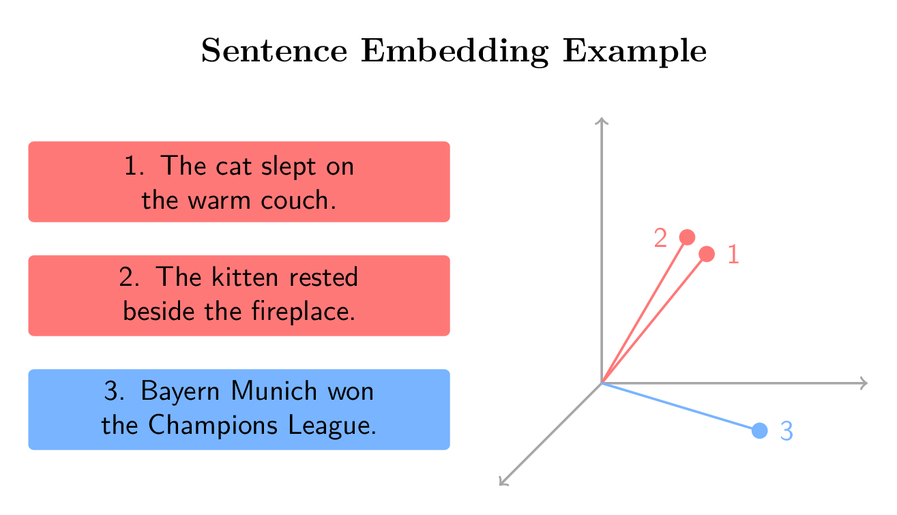
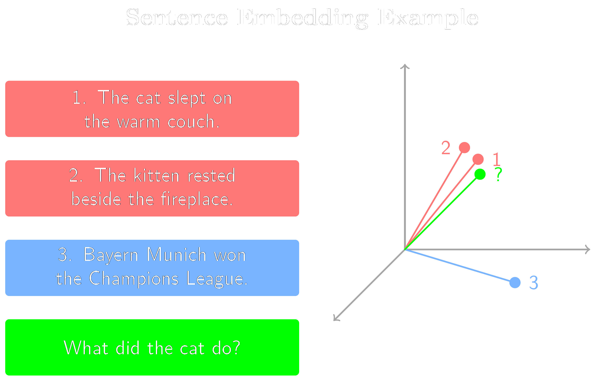

# 🧠 RAG Chatbot mit LLMClient (Groq, OpenAI & Hugging Face)

## 📑 Inhaltsverzeichnis

- [Überblick über Retrieval-Augmented Generation](#%C3%BCberblick-%C3%BCber-retrieval-augmented-generation-rag)
- [Inhalt des Notebooks](#-inhalt-des-notebooks)
- [Erforderliche API Keys](#-erforderliche-api-keys)
- [Hugging Face Access Token erstellen](#-hugging-face-access-token-erstellen)
- [Groq API Key erstellen](#%EF%B8%8F-groq-api-key-erstellen)
- [OpenAI API Key erstellen](#-openai-api-key-erstellen)
- [API Keys als Secrets in Google Colab hinterlegen](#%EF%B8%8F-api-keys-als-secrets-in-google-colab-hinterlegen)
- [Nutzung von LLMClient im Notebook](#%EF%B8%8F-nutzung-von-llmclient-im-notebook)
- [Ressourcen zu RAG](#ressourcen-zu-rag)
- [Lizenz](#-lizenz)

Das Notebook [`RAGChatbot_groq_API.ipynb`](RAGChatbot_groq_API.ipynb) zeigt, wie man mit der Klasse [`LLMClient`](../llm_client/llm_client.py) einen **Retrieval-Augmented-Generation (RAG)**-Chatbot erstellt, der wahlweise über **Groq**, **OpenAI** oder **Ollama** betrieben wird.  

<p align="center">
   
   </p>

---

## Überblick über Retrieval-Augmented Generation (RAG)

Retrieval-Augmented Generation (RAG) kombiniert **Wissen aus eigenen Dokumenten** mit der **Sprachkompetenz großer KI-Modelle** wie ChatGPT.
Statt dass das Modell nur auf sein internes (und begrenztes) Trainingswissen zugreift, sucht RAG zuerst gezielt in einer **Wissensdatenbank** oder **Dokumentsammlung** nach relevanten Textstellen („Retrieval“) und übergibt diese dann zusammen mit der Nutzerfrage an das **Large Language Model** („Generation“).

So kann das System **aktuelle, überprüfbare und kontextbezogene Antworten** geben – z. B. auf Basis von PDF-Berichten, Forschungsartikeln oder internen Dokumentationen.
Typische Anwendungsfälle sind **Chatbots für Fachwissen**, **intelligente Assistenzsysteme** oder **unternehmensinterne Wissensassistenten**.

Das folgende Schaubild zeigt den grundlegenden Aufbau eines RAG-Systems:


*Abbildung: „High-level overview of the Retrieval Augmented Generation System“  
von [Maanjunath S Naragund](https://maanjunathn07ds.medium.com/), entnommen aus [diesem Blogbeitrag auf Medium](https://blog.gopenai.com/step-by-step-guide-to-implementing-retrieval-augmented-generation-in-python-4801be2771c3).  
Icons von Flaticon. Verwendung im Rahmen des Zitatrechts (§ 51 UrhG). Diese Abbildung steht **nicht unter der MIT-Lizenz** dieses Repositories.*

Die folgenden beiden Abbildungen veranschaulichen, wie **Satz-Embeddings** die **semantische Bedeutung** von Sätzen in einem gemeinsamen Vektorraum darstellen.
Sätze mit **ähnlicher Bedeutung** (z. B. Paraphrasen) werden als **nahe beieinanderliegende Vektoren** abgebildet, während **inhaltlich verschiedene Sätze** **weiter voneinander entfernt** liegen.
Sogenannte **Embedding-Modelle** (eine Form von LLM) wandeln Sätze dabei in diese numerischen Vektoren um, die die semantischen Eigenschaften der Sätze mathematisch erfassbar machen.

Die erste Abbildung zeigt drei Beispielsätze und deren Einbettungen in einem dreidimensionalen Raum – zwei **semantisch ähnliche Sätze** (in Rot) und einen **thematisch unabhängigen Satz** (in Blau).

<p align="center">
   
   </p>

*Abbildung: Visualisierung der semantischen Ähnlichkeit von Satz-Embeddings in einem dreidimensionalen Vektorraum.  
Eigene Darstellung, inspiriert durch das Kursmaterial aus ["Retrieval Augmented Generation (RAG)"](https://www.coursera.org/learn/retrieval-augmented-generation-rag) von [DeepLearning.AI](https://www.deeplearning.ai/) auf [Coursera](https://www.coursera.org/).*

Die zweite Abbildung erweitert dieses Beispiel um einen **Frage-Vektor** und demonstriert, wie semantische Ähnlichkeit genutzt werden kann, um **relevante Informationen** in einem **Retrieval-Augmented-Generation**-System abzurufen.

<p align="center">
   
   </p>

*Abbildung: Visualisierung der semantischen Ähnlichkeit von Satz-Embeddings in einem dreidimensionalen Vektorraum inklusive einer Frage.  
Eigene Darstellung, inspiriert durch das Kursmaterial aus ["Retrieval Augmented Generation (RAG)"](https://www.coursera.org/learn/retrieval-augmented-generation-rag) von [DeepLearning.AI](https://www.deeplearning.ai/) auf [Coursera](https://www.coursera.org/).*

---

## 🚀 Inhalt des Notebooks

Das Notebook demonstriert:

1. Installation der benötigten Packages in **Google Colab**
2. Nutzung der `LLMClient`-Klasse mit:
   - 🧩 **Groq API** *(optional)*
   - 🔮 **OpenAI API** *(optional)*
   - 💻 **Ollama (local)** *(Fallback)*
3. Aufbau eines einfachen **RAG-Workflows**:
   - PDF Dokumente laden mit [`UnstructuredReader`](https://developers.llamaindex.ai/python/framework-api-reference/readers/file/#llama_index.readers.file.UnstructuredReader) von [`llamaindex`](https://developers.llamaindex.ai/) 
   - Embeddings mit einem Embedding-Modell von [`Hugging Face`](https://huggingface.co/) erzeugen  
   - Antworten aus LLM + [`ChromaDB`](https://www.trychroma.com/)-Vektordatenbank kombinieren

---

## 🔑 Erforderliche API Keys

| Dienst | Pflicht | Zweck |
|--------|----------|--------|
| **Hugging Face Access Token** | ✅ **erforderlich** | Herunterladen des Embedding-Modells zur lokalen Ausführung |
| **Groq API Key** | optional | Nutzung der [`Groq`](https://console.groq.com/home) LLM-API |
| **OpenAI API Key** | optional | Nutzung der OpenAI LLM-API |

Wenn weder Groq- noch OpenAI-Key gesetzt sind, nutzt `LLMClient` automatisch **Ollama** (funktioniert nur lokal und nicht in Google Colab).

---

## 🦮 Hugging Face Access Token erstellen

Der Hugging Face Access Token wird benötigt, um auf **Embedding-Modelle** und andere KI-Modelle aus der Hugging Face Model Hub zuzugreifen, die zur Berechnung der Satz-Embeddings verwendet werden. Diese werden von dem Model Hub heruntergeladen und lokal ausgeführt. 

1. Erstelle kostenlosen Account bei [https://huggingface.co/](https://huggingface.co/) oder logge dich ein (falls nötig). 

2. Gehe zu [https://huggingface.co/settings/tokens](https://huggingface.co/settings/tokens)  
   <p align="center">
   
   </p>

3. Klicke auf die Schaltfläche **„Create new token“**  
   <p align="center">
   
   </p>

4. Gib einen Namen ein (z. B. `colab-rag`) und wähle **Type: Write**  
<p align="center">
   
   </p>

5. Kopiere den angezeigten Token (beginnt meist mit `hf_...`).

---

## ⚡️ Groq API Key erstellen

Der Groq API Key ermöglicht den Zugriff auf öffentlich verfügbare **LLMs**, die für besonders schnelle **Textgenerierung und Beantwortung von Fragen** im RAG-Workflow eingesetzt werden können. Diese LLMs werden in der GroqCloud ausgeführt. 

1. Erstelle kostenlosen Account bei [https://groq.com/](https://groq.com/) oder logge dich ein (falls nötig). 
2. Besuche [https://console.groq.com/keys](https://console.groq.com/keys)  
3. Klicke auf **„Create API Key“**  
   
4. Kopiere den Schlüssel (beginnt meist mit `groq_...`).

---

## 🔮 OpenAI API Key erstellen

Der OpenAI API Key erlaubt die Nutzung von **OpenAI-Modellen** (z. B. GPT-4 oder GPT-4o), um **kontextbezogene Antworten** im Retrieval-Augmented-Generation-System zu erzeugen.

1. Melde dich bei [https://platform.openai.com/account/api-keys](https://platform.openai.com/account/api-keys) an  
   
   </p>

2. Klicke auf **„Create new secret key“**  
   
   </p>

3. Kopiere den Key (beginnt meist mit `sk-...`).

---

## Google Gemini API Key erstellen

1. Besuche [Google AI Studio](https://aistudio.google.com/apikey)
2. Klicke auf **"Get API Key"** oder **"Create API Key"**
3. Wähle ein Google Cloud Projekt oder erstelle ein neues
4. Kopiere den generierten API Key (beginnt mit `AIzaSy...`)

**Hinweis**: Die Gemini API wird über den OpenAI-Kompatibilitätsmodus angesprochen, benötigt deshalb nur das `openai` Python-Package.

---

## ☁️ API Keys als Secrets in Google Colab hinterlegen

1. Klicke im Menü links auf das Schlüssel-Symbol 🔑  
   
   </p>

2. Lege folgende Secrets an:

   | Name | Wert |
   |-------|------|
   | `HF_TOKEN` | dein Hugging Face Access Token |
   | `GROQ_API_KEY` | (optional) dein Groq API Key |
   | `OPENAI_API_KEY` | (optional) dein OpenAI API Key |

---

## ⚙️ Nutzung von LLMClient im Notebook

```python
from llm_client import LLMClient

# LLMClient erkennt automatisch, welche Keys gesetzt sind
client = LLMClient()

print("Verwendete API:", client.api_choice)
print("Modell:", client.llm)
```

Falls kein Groq- oder OpenAI-Key gefunden wird, fällt der Client automatisch auf **Ollama** zurück (lokaler Betrieb).

---

## Ressourcen zu RAG

[`Coursera Kurs zu Retrieval Augmented Generation (RAG) von DeepLearning.AI`](https://www.coursera.org/learn/retrieval-augmented-generation-rag/)

---

## 🧩 Lizenz

Dieses Notebook ist Teil des Repositories [**dgaida/llm_client**](https://github.com/dgaida/llm_client).  
© 2025 – Daniel Gaida, Technische Hochschule.  
Lizenziert unter der **MIT License**.
